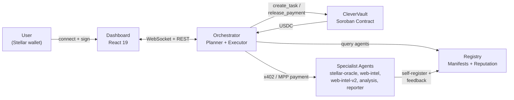
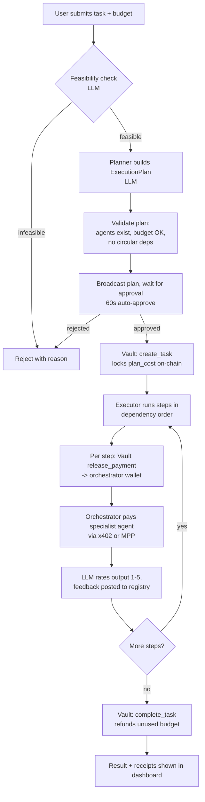
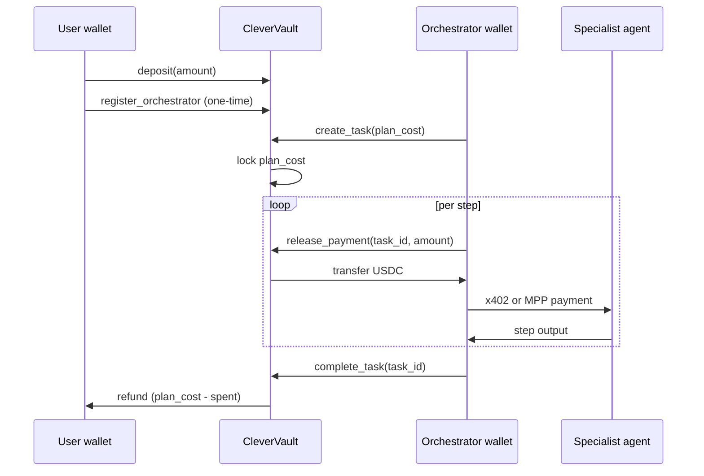

# Architecture

This document describes how CleverCon's pieces fit together today, and how
the architecture is expected to evolve per [ROADMAP.md](../ROADMAP.md).

## System overview



## Components

| Package | Role |
|---|---|
| `packages/common` | Shared TypeScript types (`AgentManifest`, `AgentRecord`, `ExecutionPlan`, `TaskResult`, ...), Stellar network constants, a small logger, and wallet-loading helpers. Imported by every backend package. |
| `packages/registry` | Express API for agent discovery and reputation. Agents self-register on startup; the orchestrator queries it when building a plan; feedback after each job updates an agent's reputation score. Backed by a JSON file (`data/registry.json`). |
| `packages/orchestrator` | The core service. Plans tasks via an LLM (currently Claude Sonnet via the Anthropic API), validates and executes the plan, talks to CleverVault to lock/release funds, pays agents via x402/MPP, and serves the dashboard over REST + WebSocket. |
| `packages/dashboard` | React 19 + Vite + Tailwind frontend for connecting a wallet, funding the vault, submitting and approving tasks, and viewing history. Out of scope for the current backend-hardening effort. |
| `packages/agents/*` | Five specialist agents (`stellar-oracle`, `web-intel`, `web-intel-v2`, `analysis`, `reporter`), each an Express server exposing a manifest, a `/health` endpoint, and a paid query endpoint. |
| `contracts/agent-vault` | **CleverVault** - the Soroban contract that holds user USDC and enforces the budget lifecycle on-chain. |
| `contracts/budget-guardian` | An earlier, simpler budget-tracking contract. Not used by the current orchestrator (superseded by CleverVault); kept for historical reference. |

## Trust model

CleverCon's trustlessness applies to specific layers of the system, not all of
them. Being clear about this matters for users and contributors evaluating the
platform.

### What is cryptographically enforced

- **USDC custody:** CleverVault holds all user funds. The contract is the only
  entity that can release payments. The operator cannot access user balances.
- **Per-step payment release:** payments release only after the specific step
  is executed and authorized. The operator cannot drain funds even if the
  orchestrator misbehaves.
- **Settlement finality:** all payments are real Stellar transactions with
  verifiable hashes. No off-chain accounting, no IOUs.

### What currently requires trusting the operator

- **Task decomposition:** the orchestrator (run by the platform operator)
  decides how to break a task into steps. A malicious orchestrator could
  generate wasteful plans. Mitigation: plans are shown to users for explicit
  approval before execution begins.
- **Agent selection:** the orchestrator picks which specialist fills each step.
  Mitigation: selection logic is open-source and auditable; reputation scoring
  is transparent; a future on-chain registry will enable verifiable selection.
- **Quality rating:** reputation updates are computed by an LLM rating service
  (currently Claude Haiku). The operator could influence ratings. Mitigation:
  the rating service is being refactored to support multiple providers; user-
  driven ratings weighted by on-chain history are on the roadmap.

### Roadmap toward less trust

- **Phase 2:** on-chain Agent Registry contract removes the registry as a
  centralized data point. Agent status is readable directly from the chain.
- **Phase 5+:** multi-orchestrator support lets third parties run their own
  orchestrators against the shared registry. Users choose which orchestrator
  to use based on track record, fee, or features. This removes the operator
  monopoly on task decomposition and agent selection.
- **Long-term:** community-driven reputation rating, moving away from reliance
  on any single LLM provider.

CleverCon is more trustless than centralized AI services (custody and
settlement are on-chain) but less trustless than a fully decentralized
protocol (orchestration involves operator-run infrastructure). The roadmap
progressively closes that gap.

## Task lifecycle



The current LLM implementation uses Claude Sonnet for planning and Claude Haiku
for feasibility checks and output rating. The provider is being decoupled behind
an interface in Phase 4 of the roadmap so operators can swap providers.

The full pipeline lives in `packages/orchestrator/src/server.ts`'s `runTask()`
and `packages/orchestrator/src/executor.ts`'s `PlanExecutor`.

## Fund flow - CleverVault

CleverVault (`contracts/agent-vault`) is a Soroban contract that holds USDC on
behalf of users. The orchestrator never custodies user funds beyond the brief
moment it takes to relay a per-step payment to a specialist agent.



### On-chain guarantees

| Guarantee | Enforcement |
|---|---|
| One active task at a time per user | `active_tasks_count == 0` required to start a task |
| No overspending | `release_payment` is capped at the task's remaining `plan_cost` |
| No mid-task withdrawals | `active_tasks_count == 0` required to call `withdraw` |
| Unused budget refunded | `finalize_task` returns `plan_cost - spent` to the user automatically |
| Stuck task recovery | Anyone can call `force_complete_stale_task` after 30 minutes (`STALE_TASK_THRESHOLD_SECONDS`) |
| Abort anytime | `cancel_task` (user-authorized) refunds remaining locked funds immediately |

### Contract data model

- `UserAccount` - `balance`, `locked`, `total_deposited`, `total_spent`,
  `active_tasks_count`, and an optional linked `orchestrator` address.
- `TaskInfo` - `user`, `orchestrator`, `plan_cost`, `spent`, `completed`,
  `created_at`.
- A reverse-lookup `OrchestratorOwner(orchestrator) -> user` lets the contract
  resolve which user's funds an orchestrator-authorized call should affect.

See the doc comments in
[`contracts/agent-vault/src/lib.rs`](../contracts/agent-vault/src/lib.rs) for
per-function parameters, return values, and authorization requirements.

## Payment protocols

### x402 - per-call HTTP micropayments

Used by `stellar-oracle`, `web-intel`, `web-intel-v2`, and `reporter`.

```
Orchestrator                          Specialist agent
     |-- POST /query ----------------->|
     |<-- 402 Payment Required --------|
     |    { amount: "0.02", currency: "USDC" }
     |                                  |
     |  [CleverVault releases funds to  |
     |   the orchestrator wallet]       |
     |                                  |
     |-- POST /query + X-Payment: <tx> >|
     |<-- 200 OK + data ---------------|
```

Implemented in `packages/orchestrator/src/x402-client.ts`
(`makeX402Payment`), built on `@x402/fetch` and `@x402/stellar`. Each attempt
(up to 3, with exponential backoff) uses a fresh signer to avoid stale Stellar
sequence numbers.

### MPP - streaming session payments

Used by `analysis`. Opens a pre-authorized payment session and settles the
actual amount used at the end of the call.

```
Orchestrator                          AnalysisBot
     |-- open MPP session (auth amount) ->|
     |<-- stream output ----------------  |
     |-- settle: actual amount used ----->|
     |   (difference returned to vault)   |
```

Implemented in `packages/orchestrator/src/mpp-client.ts`
(`makeMPPPayment`), built on `mppx` / `@stellar/mpp`.

## Agent selection and reputation

Two related but distinct scoring calculations exist:

1. **Reputation score** (`packages/registry/src/reputation.ts`,
   `calculateScore`) - a 0-100 score stored on each `AgentRecord`, recomputed
   after every job from cumulative feedback:

   | Factor | Weight |
   |---|---|
   | Success rate | 40% |
   | Average quality rating (1-5) | 35% |
   | Speed (latency-based) | 15% |
   | Experience bonus (jobs completed, capped at 50) | 10% |

2. **Agent selection score** (`packages/orchestrator/src/selector.ts`,
   `scoreAgents`) - used by the orchestrator when choosing which agent fills
   a plan step:

   | Factor | Weight |
   |---|---|
   | Capability match | 35% |
   | Reputation score (from above) | 30% |
   | Price efficiency | 15% |
   | Latency | 10% |
   | Discovery bonus (agents with < 5 jobs) | 10% |

After each step, `packages/orchestrator/src/rater.ts` asks the configured LLM
to rate the output 1-5 (defaulting to 3 on error), and
`packages/orchestrator/src/executor.ts` posts that feedback to the registry's
`POST /feedback` endpoint, which feeds back into the reputation score.

## Data persistence

The registry and orchestrator persist state as JSON files under `data/`
(gitignored, created at runtime):

| File | Written by | Contents |
|---|---|---|
| `data/registry.json` | `packages/registry/src/store.ts` | Agent manifests and reputation |
| `data/orchestrators.json` | `packages/orchestrator/src/orchestrator-store.ts` | Per-user orchestrator wallet records, **including secret keys in plaintext** (a known pre-production gap - see [SECURITY.md](../SECURITY.md)) |
| `data/vault-ledger.json` | `packages/orchestrator/src/vault-ledger.ts` | Deposit/withdrawal/payment ledger for the dashboard |
| `data/activity-log.json` | `packages/orchestrator/src/activity-store.ts` | Recent task lifecycle events, used for the activity feed and pulse stats |
| `data/task-results.json` | `packages/orchestrator/src/task-results.ts` | Completed task results (prompt, steps, output, cost) |

None of these stores currently have file-locking, so concurrent writes can
race - see the open issues for planned fixes.

## Future architecture

The current registry is an off-chain Express service, and specialist agents
each reimplement their own x402/MPP server setup and registration logic. Per
[ROADMAP.md](../ROADMAP.md), the next phases move toward:

- An **on-chain Agent Registry contract** (Soroban), so agent manifests and
  reputation are independently verifiable rather than living in a single
  service's JSON file.
- A **Stellar MCP server**, exposing registry discovery and vault read views
  as MCP tools so any MCP-compatible client can find and pay CleverCon agents.
- A **specialist Agent SDK** (`@clevercon/agent-sdk`) that packages the
  x402/MPP scaffolding, manifest/health endpoints, and self-registration
  currently duplicated across `packages/agents/*`.
- A **pluggable LLM provider interface** that decouples the orchestrator from
  the Anthropic SDK and allows swapping between providers based on cost,
  performance, or operational requirements.

These four pieces (hardened CleverVault + the three above) are the priority
areas for new contributions - see [CONTRIBUTING.md](../CONTRIBUTING.md).
